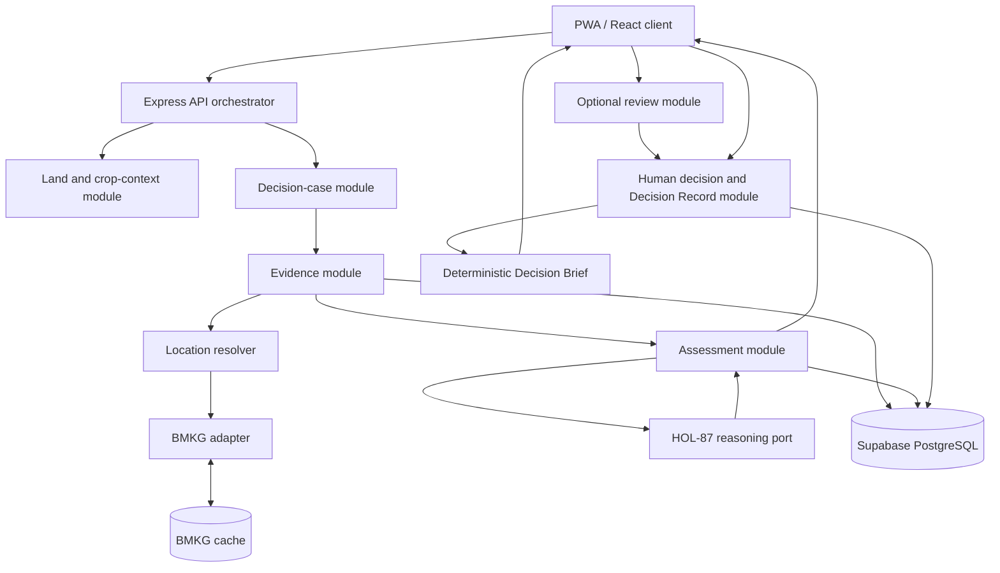

# Backend Architecture

RembukTani M2 menggunakan modular monolith. Satu proses backend boleh memuat semua
module, tetapi boundary domain tetap dipisahkan agar kontrak HOL-86, HOL-87, dan
HOL-88 tidak tercampur.

## Proposed folder structure

```text
backend/
├── src/
│   ├── app.ts                    # Express composition: middleware + routes
│   ├── server.ts                 # Process entry point and listen
│   ├── config.ts                 # Environment parsing and runtime config
│   │
│   ├── shared/
│   │   ├── errors/               # Typed application errors and error codes
│   │   ├── http/                 # HTTP response helpers and request context
│   │   ├── time/                 # UTC parsing and deterministic evaluation clock
│   │   └── types/                # Small cross-module primitives only
│   │
│   ├── domain/
│   │   ├── contracts/            # Canonical DTOs and enums used at boundaries
│   │   ├── evidence/              # Evidence identity, provenance, freshness types
│   │   ├── assessment/            # Assessment, factors, options, explanation types
│   │   └── decision/              # Review and immutable Decision Record types
│   │
│   ├── infrastructure/
│   │   ├── persistence/           # DB client, repositories, migrations adapter
│   │   ├── cache/                 # BMKG cache and cache metadata
│   │   ├── bmkg/                  # BMKG HTTP client and raw response storage
│   │   ├── reasoning/             # HOL-87 reference-engine adapter
│   │   ├── location/               # Location -> verified adm4 resolver
│   │   └── observability/          # Redacted structured logging
│   │
│   ├── modules/
│   │   ├── lands/                 # Land CRUD and active crop context
│   │   ├── crop-contexts/          # Crop context lifecycle/versioning
│   │   ├── decision-cases/         # Manual bounded case creation and state
│   │   ├── evidence/               # Field Pulse + external evidence orchestration
│   │   ├── assessments/            # Evaluate evidence through HOL-87 port
│   │   ├── reviews/                # Optional trusted review branch
│   │   ├── decision-records/       # Explicit human decision + immutable revision
│   │   └── sharing/                # Deterministic Decision Brief/share text
│   │
│   └── routes/
│       └── index.ts               # Route registration only
│
├── tests/
│   ├── unit/                      # Pure mapper, freshness, formatter tests
│   ├── integration/               # API + persistence + adapter tests
│   └── fixtures/                  # M2 scenarios and API payloads
│
├── migrations/                    # Physical DB migrations
├── seeds/                         # Demo seed/reset data
└── docs/                          # Backend API and deployment notes
```

## Module rule

Each module owns its use cases, input validation, controller, and repository
interfaces. A module may depend on `domain`, `shared`, and infrastructure ports;
it must not import another module's private implementation. Cross-module behavior
is composed in a use-case/orchestrator, not in Express route handlers.

Recommended internal shape for a module:

```text
modules/evidence/
├── evidence.routes.ts
├── evidence.controller.ts
├── evidence.schemas.ts
├── evidence.service.ts
├── evidence.repository.ts
└── evidence.mapper.ts
```

Keep controllers thin. Business rules belong in services or pure domain functions;
external calls belong behind infrastructure adapters.

## Main request flow

```text
HTTP route
  -> controller
  -> application service/orchestrator
  -> repository / external port / reasoning port
  -> canonical response DTO
```

The core M2 flow is:

```text
Decision Case
  -> BMKG adapter + Field Pulse
  -> Evidence Service validates and persists canonical evidence
  -> Assessment Service builds HOL-87 projection
  -> Reasoning adapter returns assessment/options
  -> Assessment Service persists versioned result
  -> Human Decision Service creates immutable Decision Record
  -> Sharing Service formats a deterministic Decision Brief
```

## Boundary rules

- Raw BMKG response is stored separately from normalized canonical evidence.
- BMKG forecast is external evidence, never local water-state evidence.
- Field Pulse accepts `unknown`; it is valid data, not a validation error.
- Freshness is calculated using an explicit UTC `evaluated_at`, not persisted as
  permanent truth. Store the evaluation timestamp with the assessment.
- `available`, `cached`, `stale`, and `unavailable` are distinct states. Cached
  evidence must never be presented as a live fetch.
- Reasoning may produce `assessment_unavailable` or abstain. The backend must not
  synthesize a plausible assessment on adapter failure.
- HOL-87 output returns to the application flow. It never creates a final decision
  and never triggers irrigation or another autonomous action.
- M2 emits stable bounded option IDs in display order. No ranking, score 0-100, or
  `recommended_option_id` is allowed.
- A Decision Record is created only after an explicit human command and must carry
  evidence/assessment snapshot references, `authority: human`, limitations, and
  `is_mock` provenance.
- Material changes create a new revision with `supersedes_record_id`; no silent
  overwrite.
- Demo fixtures may be used only in demo/staging and must retain the MOCK/DEMO
  marker through evidence, assessment, and Decision Record.

## Suggested API surface

| Area | Endpoint | Purpose |
|---|---|---|
| Health | `GET /api/health` | Process health check |
| Lands | `GET/POST /api/lands` | List/create lands |
| Lands | `GET/PATCH /api/lands/:landId` | Read/update a land |
| Crop context | `GET/PUT /api/lands/:landId/crop-context` | Read/update active crop context |
| Cases | `POST /api/lands/:landId/decision-cases` | Start a manual Decision Case |
| Evidence | `POST /api/decision-cases/:caseId/field-pulse` | Save Field Pulse |
| Evidence | `POST /api/decision-cases/:caseId/bmkg/refresh` | Fetch/cache/normalize BMKG |
| Assessment | `POST /api/decision-cases/:caseId/assessments` | Run deterministic assessment |
| Assessment | `GET /api/decision-cases/:caseId/assessment` | Read assessment and options |
| Review | `POST /api/decision-cases/:caseId/reviews` | Request/submit optional review |
| Decision | `POST /api/decision-cases/:caseId/decision-records` | Confirm explicit human decision |
| Decision | `GET /api/decision-records/:recordId` | Read immutable record |
| Sharing | `GET /api/decision-records/:recordId/brief` | Generate deterministic brief |

Exact routes may change during API review. The semantics must remain equivalent.

## Dependency direction

```text
routes/controllers
        |
        v
application modules ---> domain contracts
        |
        +---------------> infrastructure ports
                              |
                              +-> BMKG/cache/database/location/reasoning adapters
```

Do not let the frontend call BMKG directly. Do not let a repository decide
agronomic meaning. Do not let the reasoner write Decision Records.

## Implementation order

1. Lock physical persistence and repository interfaces for Land, CropContext,
   DecisionCase, Evidence, Assessment, options, reviews, and Decision Records.
2. Add fixture seed/reset and make DEMO-WATER-01 load without manual DB edits.
3. Implement Field Pulse and canonical evidence validation.
4. Implement BMKG adapter, raw snapshot/reference, cache metadata, and failure flow.
5. Integrate the HOL-87 reasoning port and verify T1-T8 expectations.
6. Implement explicit human decision, immutable revisions, and Decision Brief.
7. Connect the frontend workflow and add API integration tests for happy and failure
   states.

Auth/RBAC, exact database vendor, location provider, and production retention are
still review decisions. Keep them behind interfaces so they do not shape the
canonical domain objects prematurely.

## Implementation audit — 4 September 2026

The current repository implements the M2 backend baseline:

| Area | Current state |
|---|---|
| Frontend | React + Vite + TypeScript starter; domain screens are the next implementation phase. |
| Backend composition | Express app with health endpoint, CORS, JSON limit, rate limit, and error handler. |
| Location | BIG point lookup and explicit BMKG `adm4` verification spike implemented. |
| BMKG | Client, canonical normalizer, live/cache adapter, and unit tests implemented. |
| Domain modules | Directories exist as boundaries; most use cases and routes are still pending. |
| Persistence | Supabase PostgreSQL migration 001 + audit migration 002, RLS, and repositories implemented. |
| Reasoning | Deterministic TypeScript HOL-87 water-v0.2 engine integrated into the assessment route. |
| Tests | BMKG and reasoning unit tests pass; API/persistence integration tests remain the next hardening step. |

Assessment behavior currently lives in the TypeScript reasoning and repository
boundaries; the empty legacy module folders are not used by the API composition.

## Runtime flow



The diagram describes the implemented M2 path. The critical safety path remains:

```text
Reasoning -> Assessment/Options -> Human Decision -> Decision Record
```

There is no reasoning-to-autonomous-action path.
